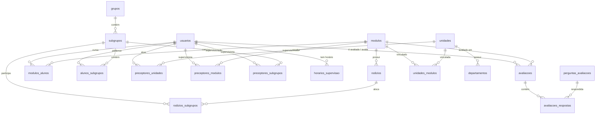

# Interdisciplinar-Med — Sistema de Gestão do Internato Médico

Sistema web para gerenciamento do internato médico, incluindo controle de rodízios, avaliações, grupos de alunos, preceptores e unidades de saúde. Desenvolvido em **PHP** com **MySQL** e **Bootstrap 5**.

---

## Índice

- [Sobre o Projeto](#-sobre-o-projeto)
- [Funcionalidades](#-funcionalidades)
- [Tecnologias Utilizadas](#-tecnologias-utilizadas)
- [Estrutura do Projeto](#-estrutura-do-projeto)
- [Modelo de Dados](#-modelo-de-dados)
- [Pré-requisitos](#-pré-requisitos)
- [Instalação e Configuração](#-instalação-e-configuração)
- [Uso](#-uso)
- [Papéis de Usuário](#-papéis-de-usuário)

---

## Sobre o Projeto

O **Interdisciplinar-Med** é uma aplicação web voltada para a **coordenação do internato em cursos de Medicina**. O sistema permite que coordenadores, preceptores e alunos interajam de forma organizada no gerenciamento de módulos curriculares, rodízios em unidades de saúde, avaliações de desempenho e alocação de grupos.

O projeto foi desenvolvido como trabalho interdisciplinar acadêmico e abrange todo o fluxo de gestão do internato — desde o cadastro de usuários até a geração de relatórios.

---

## Publicação Acadêmica

Este projeto deu origem a um artigo científico publicado na **Revista Ibero-Americana de Humanidades, Ciências e Educação (REASE)**:

> **DESENVOLVIMENTO DE UM SISTEMA WEB PARA GERENCIAMENTO DE INTERNATOS MÉDICOS: DIGITALIZAÇÃO DE PROCESSOS E OTIMIZAÇÃO DA GESTÃO ACADÊMICA**
>
> _João Victor da Silva Alves · Jackson Garcês Damasceno · Pedro Gabriel Guimarães Costa Carioca · Edilson Carlos Silva Lima · Yonara Costa Magalhães_
>
> Universidade CEUMA — v. 12 n. 1 (2026)

**DOI:** [https://doi.org/10.51891/rease.v12i1.23332](https://doi.org/10.51891/rease.v12i1.23332)

**Resumo:** O internato médico representa uma etapa fundamental da formação acadêmica, exigindo organização de avaliações, notas, grupos, rodízios, registros administrativos e interação entre alunos, preceptores e coordenação. Em muitas instituições, esses processos ainda são realizados manualmente, o que gera burocracia, elevado consumo de recursos e risco de perda de informações. O estudo apresenta o desenvolvimento do Intermed, um sistema web responsivo voltado à gestão de internatos médicos, com a finalidade de digitalizar integralmente os fluxos institucionais e ampliar a eficiência operacional. Os resultados demonstraram a viabilidade técnica do sistema, evidenciando potencial para aumentar a eficiência, reduzir o tempo de gestão e ampliar a rastreabilidade dos processos.

[Ler o artigo completo](https://periodicorease.pro.br/rease/article/view/23332/14994)

---

## Funcionalidades

### Gestão de Usuários

- Cadastro e login com autenticação por sessão
- Três perfis de acesso: **Coordenação**, **Preceptor** e **Aluno**
- Edição de perfil e alteração de dados pessoais
- Ativação/desativação de contas
- Importação em massa via arquivo CSV (**usuarios.csv**, **preceptores.csv**, **modulos.csv**)

### Módulos Curriculares

- CRUD completo de módulos do internato
- Associação de alunos a módulos por período
- Vinculação de unidades de saúde a módulos
- Associação de preceptores a módulos

### Unidades de Saúde e Departamentos

- Cadastro de unidades com nome e endereço
- Gestão de departamentos (setores) por unidade
- Vinculação de preceptores a unidades

### Grupos e Subgrupos

- Criação de grupos e subgrupos de alunos
- Alocação de alunos em subgrupos
- Associação de preceptores a subgrupos

### Rodízios

- Planejamento de rodízios por período e módulo
- Definição de datas de início e fim
- Vinculação de subgrupos de alunos aos rodízios

### Avaliações

- Sistema de avaliações com perguntas configuráveis
- Tipos de resposta: **texto**, **numérico** e **escala**
- Registro de notas por preceptor para cada aluno/módulo
- Perguntas ativáveis/desativáveis pela coordenação

### Horários de Supervisão

- Cadastro de horários de atendimento dos preceptores
- Organização por dia da semana, módulo e unidade
- Consulta de horários por alunos e coordenação

### Relatórios

- Geração de relatórios gerenciais pela coordenação

### Notificações por E-mail

- Envio de e-mails via **PHPMailer** (ex.: confirmação de cadastro)

---

## Tecnologias Utilizadas

| Camada         | Tecnologia                                     |
| -------------- | ---------------------------------------------- |
| **Back-end**   | PHP 8.2+                                       |
| **Banco**      | MySQL 8.0 (schema `proj_internato`)            |
| **Container**  | Docker & Docker Compose                        |
| **Front-end**  | HTML5 · CSS3 · Bootstrap 5.3 · Bootstrap Icons |
| **JS**         | SweetAlert2 (alertas e confirmações)           |
| **E-mail**     | PHPMailer 6.9+                                 |
| **Servidor**   | Apache (integrado via Docker ou XAMPP)         |

---

## Estrutura do Projeto

```
Interdisciplinar-Med/
├── index.php                   # Página de login
├── composer.json               # Dependências PHP (PHPMailer)
├── docker-compose.yml          # Orquestração de containers (App + DB)
├── Dockerfile                  # Configuração da imagem PHP/Apache
│
├── BANCO.sql                   # Script principal de criação do banco
├── Procedure.sql               # Procedures do sistema
├── view.sql                    # Views para relatórios e listagens
├── function.sql                # Funções SQL auxiliares
├── avaliações.sql              # Script para dados de avaliações
├── usuarios.csv                # Exemplo para importação de usuários
├── preceptores.csv             # Exemplo para importação de preceptores
├── modulos.csv                 # Exemplo para importação de módulos
│
├── cfg/
│   └── config.php              # Configuração do banco (suporta Env Vars)
│
├── cadastro_e_login/
│   ├── cadastro.php            # Tela de cadastro de usuário
│   ├── novocadastro.php        # Processamento do cadastro
│   ├── login.php               # Processamento do login
│   ├── logout.php              # Encerramento de sessão
│   └── index.php               # Redirecionamento
│
├── includes/
│   ├── navbar.php              # Barra de navegação superior
│   ├── menu-lateral-aluno.php        # Menu lateral — Aluno
│   ├── menu-lateral-preceptor.php    # Menu lateral — Preceptor
│   ├── menu-lateral-coordenacao.php  # Menu lateral — Coordenação
│   ├── perfil.php / perfil-view.php  # Visualização de perfil
│   ├── alterar-dados.php             # Alteração de dados do usuário
│   ├── editar-usuario.php            # Edição de usuário (admin)
│   └── redirecionar.php              # Redirecionamento por tipo de usuário
│
├── pages/
│   ├── aluno/                  # Páginas do aluno
│   │   ├── home.php
│   │   ├── horarios.php
│   │   ├── notas.php
│   │   └── rodizios.php
│   │
│   ├── preceptor/              # Páginas do preceptor
│   │   ├── home.php
│   │   ├── avaliacoes/         # Avaliações de alunos
│   │   ├── grupos.php
│   │   ├── horarios.php
│   │   ├── listar-aluno.php
│   │   └── rodizios.php
│   │
│   └── coordenacao/            # Páginas da coordenação
│       ├── home.php
│       ├── unidades/           # CRUD de unidades e departamentos
│       ├── modulos/            # CRUD de módulos
│       ├── grupos/             # Gestão de grupos e subgrupos
│       ├── rodizios/           # Gestão de rodízios
│       ├── avaliacoes/         # Configuração de avaliações
│       ├── horarios/           # Horários de supervisão
│       ├── usuarios/           # Gestão de usuários
│       ├── listar-aluno.php
│       ├── listar-preceptor.php
│       ├── associar-preceptor.php
│       └── relatorios.php
│
├── css/
│   └── style.css               # Estilos customizados
│
├── img/                        # Imagens (background, etc.)
├── script/                     # Scripts auxiliares
└── vendor/                     # Dependências do Composer
```

---

## Modelo de Dados

O banco de dados `proj_internato` é composto pelas seguintes tabelas:



### Tabelas Principais

| Tabela                  | Descrição                                              |
| ----------------------- | ------------------------------------------------------ |
| `usuarios`              | Usuários do sistema (alunos, preceptores, coordenação) |
| `modulos`               | Módulos curriculares do internato                      |
| `modulos_alunos`        | Relação N:N entre alunos e módulos                     |
| `grupos`                | Grupos de alunos                                       |
| `subgrupos`             | Subdivisões dos grupos                                 |
| `alunos_subgrupos`      | Relação N:N entre alunos e subgrupos                   |
| `unidades`              | Unidades de saúde (hospitais, UBS, etc.)               |
| `departamentos`         | Departamentos/setores dentro de unidades               |
| `unidades_modulos`      | Relação N:N entre unidades e módulos                   |
| `rodizios`              | Rodízios programados por período                       |
| `rodizios_subgrupos`    | Relação N:N entre rodízios e subgrupos                 |
| `avaliacoes`            | Avaliações realizadas por preceptores                  |
| `perguntas_avaliacoes`  | Perguntas configuráveis das avaliações                 |
| `avaliacoes_respostas`  | Respostas registradas para cada pergunta               |
| `preceptores_unidades`  | Relação entre preceptores e unidades                   |
| `preceptores_modulos`   | Relação entre preceptores e módulos                    |
| `preceptores_subgrupos` | Relação entre preceptores e subgrupos                  |
| `horarios_supervisao`   | Horários de atendimento dos preceptores                |

---

## Pré-requisitos

- **Docker** & **Docker Compose** (Recomendado)
- **OU** ambiente local com:
  - **PHP** 8.2 ou superior
  - **MySQL** 8.0+
  - **Apache** com `mod_rewrite` habilitado
  - **Composer** (para gerenciamento de dependências)

---

## Instalação e Configuração

### 1. Clonar o repositório

```bash
git clone https://github.com/seu-usuario/Interdisciplinar-Med.git
cd Interdisciplinar-Med
```

### 2. Opção A: Docker

O projeto já inclui um ambiente Docker pronto para uso. O banco de dados será inicializado automaticamente com todos os scripts necessários.

1.  Certifique-se de que o Docker está rodando.
2.  Execute o comando para subir os containers:
    ```bash
    docker-compose up -d --build
    ```
3.  Acesse o sistema em: `http://localhost:8080/Interdisciplinar-Med/`
    - *Nota: O banco de dados estará disponível externamente na porta 3307.*

### 3. Opção B: Instalação Manual (XAMPP / WAMP / LAMP)

1.  Mova a pasta para o diretório raiz do Apache (`htdocs` ou `www`).
2.  Instale as dependências via Composer:
    ```bash
    composer install
    ```
3.  Crie o banco de dados `proj_internato` e importe os scripts na seguinte ordem:
    1. `BANCO.sql`
    2. `Procedure.sql`
    3. `view.sql`
    4. `function.sql`
4.  Configure a conexão em `cfg/config.php`:
    ```php
    define('HOST', 'localhost');
    define('USER', 'root');
    define('PASS', 'sua_senha');
    define('BASE', 'proj_internato');
    ```

---

## Uso

1. **Acesse** a tela de login em `index.php`
2. **Cadastre-se** clicando em "Cadastro" (novo usuário aguarda ativação pela coordenação)
3. **Faça login** com suas credenciais
4. O sistema redirecionará automaticamente para o painel correspondente ao seu perfil

---

## Papéis de Usuário

### Aluno

- Visualizar seus rodízios e cronograma
- Consultar notas e avaliações recebidas
- Verificar horários de supervisão dos preceptores
- Editar perfil pessoal

### Preceptor

- Listar alunos sob supervisão
- Realizar avaliações de desempenho dos alunos
- Consultar grupos e subgrupos
- Visualizar rodízios e horários
- Gerenciar perfil

### Coordenação

- **Unidades**: Cadastrar e gerenciar unidades de saúde e departamentos
- **Módulos**: Criar módulos curriculares e vincular a unidades
- **Grupos**: Organizar alunos em grupos e subgrupos
- **Rodízios**: Planejar rodízios com datas e subgrupos
- **Avaliações**: Configurar perguntas e acompanhar avaliações
- **Preceptores**: Listar, associar a unidades, módulos e subgrupos
- **Alunos**: Listar e gerenciar cadastros de alunos
- **Usuários**: Gerenciar contas (ativar/desativar), importar via CSV
- **Horários**: Consultar e gerenciar horários de supervisão
- **Relatórios**: Gerar relatórios gerenciais

---
